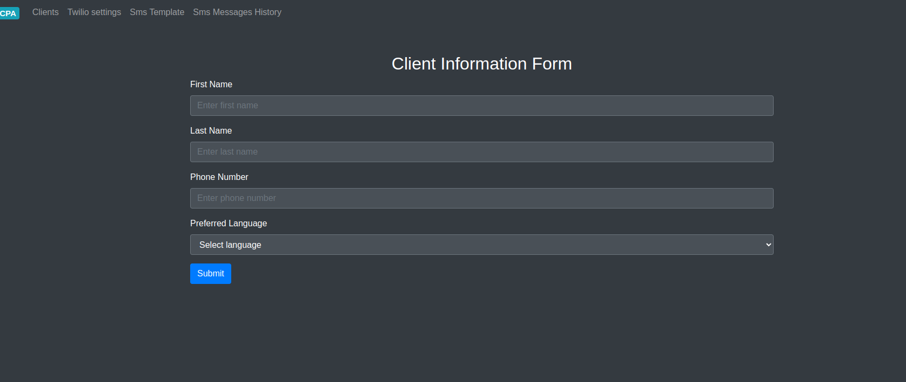

# Запуск с помощью Docker

## PHP

1. Перейти в директорию `docker`:
   ```bash
   cd docker
   ```
2. Запустить контейнеры:
   ```bash
   sudo docker-compose up
   ```
## Создать .env
```bash
cp  .env.example .env
```

```bash
sudo docker exec -it tcpa-app php artisan key:generate
```

## Установка зависимостей через контейнер
```bash
sudo docker exec -it tcpa-app composer install
```

## Выполнение миграций
```bash
sudo docker exec -it tcpa-app php artisan migrate
```

## Актуализация существующих ролей
```bash
sudo docker exec -it tcpa-app php artisan app:init-app
```

## Создание супер-администратора
```bash
sudo docker exec -it tcpa-app php artisan app:create-admin {name} {login} {password}
```

### Пример:
```bash
sudo docker exec -it tcpa-app php artisan app:create-admin admin admin admin
```

---

# СКРИНШОТЫ С ОПИСАНИЕМ

## Панель администратора
- **Страница авторизации**: [http://localhost:8252/login](http://localhost:8252/login)

Авторизоваться могут как администраторы, так и агенты.  


Чтобы создать компании и агентов, необходимо войти в систему под учетной записью администратора.  
Создать администратора можно через командную строку (описано выше).

- **Страница компаний**: [http://localhost:8252/companies](http://localhost:8252/companies)  
  На этой странице можно создавать компании, а также агентов, которые будут принадлежать этим компаниям.  
  

- **Страница агентов**, привязанных к компаниям:  
  

---

## Панель агента
Перед началом работы необходимо указать данные аккаунта Twilio:
- `SID`
- `Token`
- `Phone Number`

После этого станет доступно создание клиентов.  


- **Страница настройки Twilio**  
  На этой странице отображается уникальная ссылка вебхука для данной компании. Эту ссылку необходимо добавить в настройки Twilio.  
  

После сохранения настроек появится возможность создания клиентов.  


---

- **Страница со всеми клиентами**  
  

- **Страница создания клиентов**  
  

После создания клиента станет доступна кнопка для отправки кода подтверждения.  


- **Ввод кода подтверждения**  
  

После успешного подтверждения система отправляет запрос на получение согласия.  


На этой же форме доступен режим тестирования ответа без использования вебхука.  


- Страница для настройки шаблонов сообщения  


